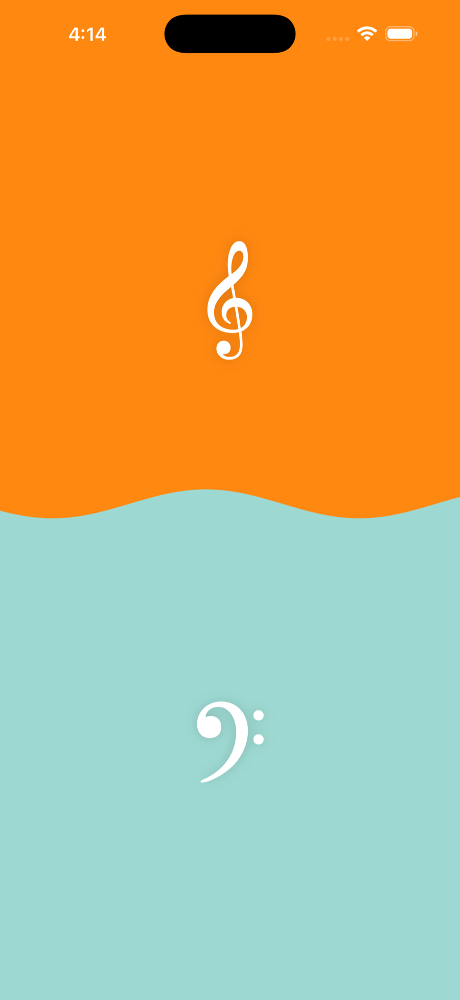
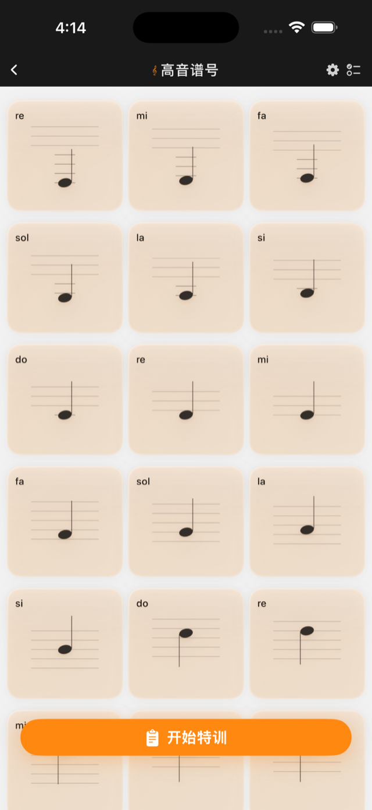
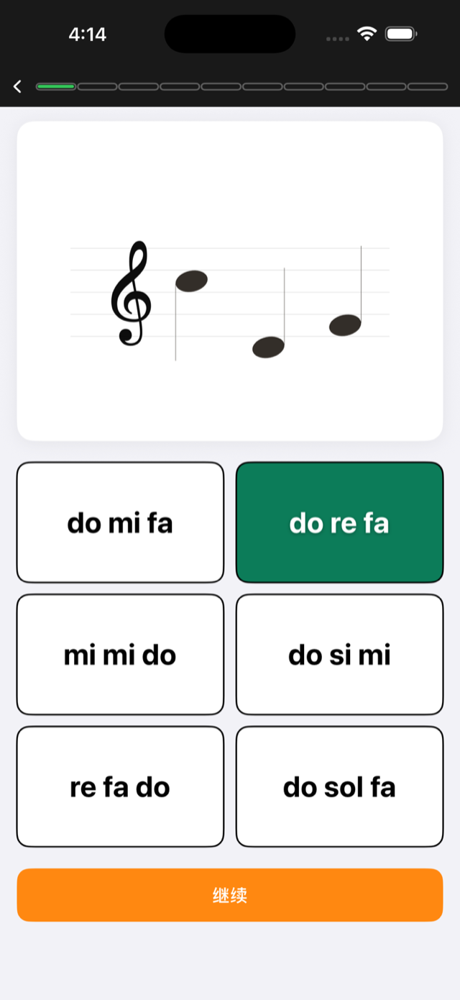

# MusicStartsHere

An iOS app for memorizing staff notation and practicing music reading through lightweight drills and instant feedback.

[App Store](https://apps.apple.com/cn/app/sonder-%E4%BA%94%E7%BA%BF%E8%B0%B1-%E7%AC%AC%E4%B8%80%E6%AD%A5%E6%98%AF%E8%AE%B0%E5%BF%86%E4%BA%94%E7%BA%BF%E8%B0%B1/id6757281903)

<p align="center">
  
</p>

## What It Does

- Memorize note positions on the staff with focused treble and bass clef drills
- Browse note cards and review visual patterns before jumping into practice
- Train with quick multiple-choice exercises and immediate right/wrong feedback
- Keep progress lightweight and repeatable so practice feels easy to return to

## Screenshots

<p align="center">
  
  
</p>

## Built With

- SwiftUI
- AVAudioEngine
- UserDefaults

## Run Locally

1. Open `MusicStartsHere.xcodeproj` in Xcode.
2. Choose a simulator or device.
3. Build and run with `Cmd+R`.

### Requirements

- Xcode 15+
- iOS 17+

## Project Structure

```text
MusicStartsHere/
├── MusicStartsHereApp.swift
├── ContentView.swift
├── Models/
├── Services/
├── Components/
└── Views/
```
